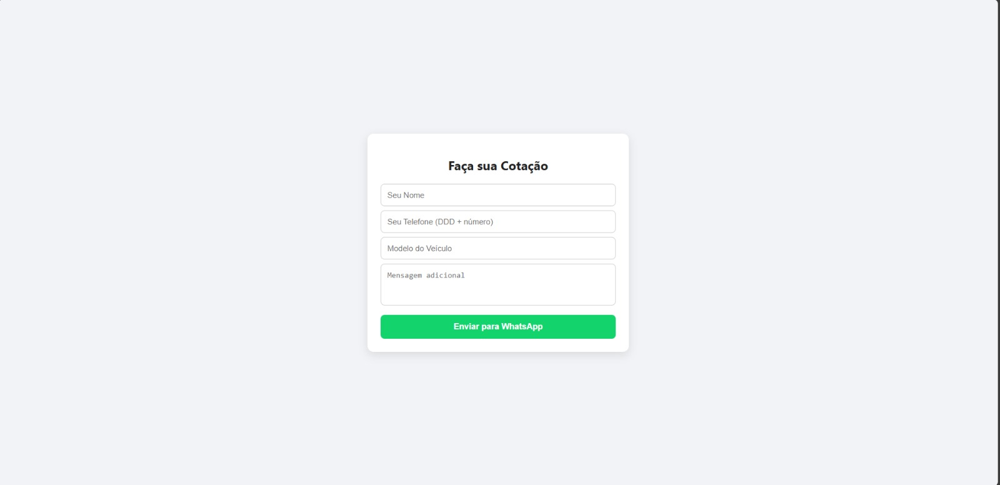

# 🚗 Cotação de Proteção Veicular — Reginilson Puma

Página simples para captar contatos e enviar uma **mensagem automática para o WhatsApp** com os dados do cliente interessado em **proteção veicular**.

---

## 🚀 Tecnologias
- HTML5
- CSS3
- JavaScript

---

## 📂 Estrutura do Projeto
```
📁 forms-puma
 ┣ 📂 css
 ┃ ┗ 📜 style.css
 ┣ 📂 js
 ┃ ┗ 📜 script.js
 ┣ 📜 index.html
 ┗ 📸 screenshot.png
```

---

## 📸 Demonstração
👉 [Acesse o projeto online](https://forms-puma.vercel.app/)



---

## 🔗 Links úteis
- Instagram: [@reginilson_puma](https://instagram.com/reginilson_puma)  
- WhatsApp direto: [Clique aqui](https://wa.me/558195028678)

---

## 🧭 Como usar
1. Preencha **nome**, **telefone** e **modelo do veículo**.  
2. Clique em **Enviar para WhatsApp**.  
3. O WhatsApp abre automaticamente com a mensagem pronta para envio.  

---

## 📜 Licença
Projeto criado para **uso real** e também para **portfólio**.  
Sinta-se à vontade para usar como referência, dando os devidos créditos.  

---

👨‍💻 Desenvolvido por **Daniel Elias de Santana**
